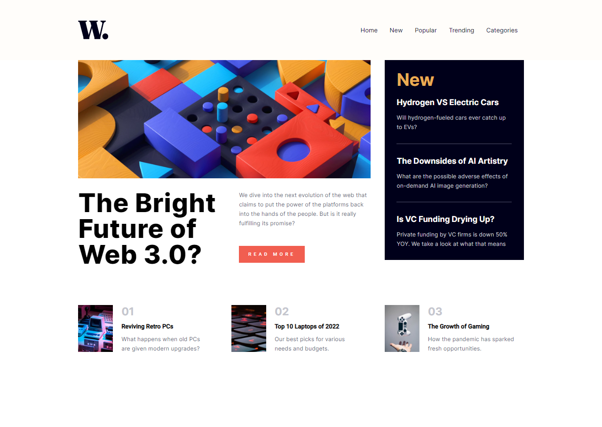

# Frontend Mentor - News homepage solution

This is a solution to the [News homepage challenge on Frontend Mentor](https://www.frontendmentor.io/challenges/news-homepage-H6SWTa1MFl). Frontend Mentor challenges help you improve your coding skills by building realistic projects. 

## Table of contents

- [Overview](#overview)
  - [The challenge](#the-challenge)
  - [Screenshot](#screenshot)
  - [Links](#links)
- [My process](#my-process)
  - [Built with](#built-with)
  - [What I learned](#what-i-learned)
  - [Continued development](#continued-development)
- [Author](#author)
- [Acknowledgments](#acknowledgments)

**Note: Delete this note and update the table of contents based on what sections you keep.**

## Overview

### The challenge

Users should be able to:

- View the optimal layout for the interface depending on their device's screen size
- See hover and focus states for all interactive elements on the page

### Screenshot

### Links

- Solution URL: [Add solution URL here](https://your-solution-url.com)
- Live Site URL: [Add live site URL here](https://your-live-site-url.com)

## My process

### Built with

- Semantic HTML5 markup
- SCSS custom properties
- Angular Material Grid
- Mobile-first workflow
- [Angular](https://angular.io) - Angular framework
- [Angular Material](https://v14.material.angular.io) - JS library

### What I learned

I reinforced my knowledge in grid layout and responsiveness, as well as typology creation and color palette.
### Continued development

Intending to improve myself in responsiveness.

## Author

- Website - [Renan Ribeiro](https://www.renan-ribeiro.web.app)
- Frontend Mentor - [@Renan-MF-Ribeiro](https://www.frontendmentor.io/profile/Renan-MF-Ribeiro)
- LinkedIn - [@Renan-Ribeiro](https://www.linkedin.com/in/renan-ribeiro-a3916711b/)

## Acknowledgments

Thanks to my wife for her patience and review of the project.
